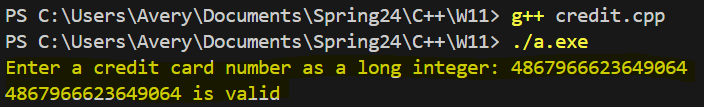
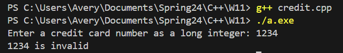

# Credit-Card-Validation-Project
This project has the user enter a credit card number, and the program determines whether the number entered is a valid credit card number or not using Luhn's Algorithm. This was a class project with guidelines stating that we had to keep the credit card number as an integer, and we could not change it to a string or array.

## Demo
This first Demo, the user entered a valid credit card number

This second Demo, the user entered an invalid credit card number

